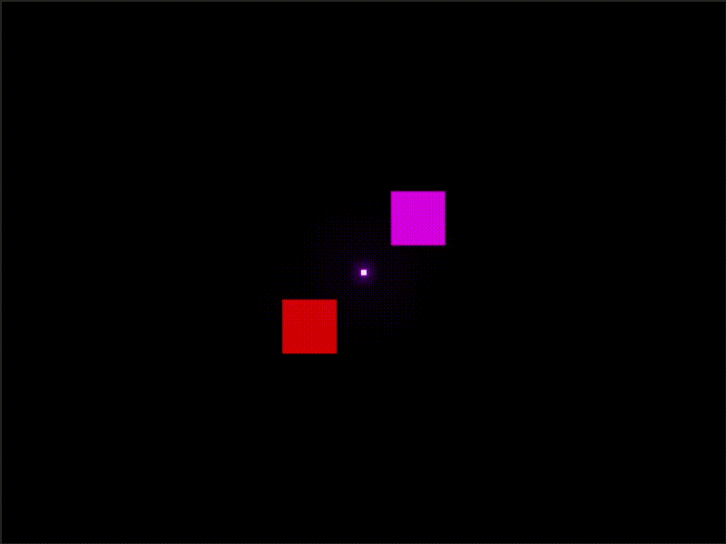

# 2D lighting

This is a small demo of dynamic 2D lighting and some post-processing effect. It
was created to learn how rendering things on the web using Emscripten works and
understand how 2D lighting works on a basic level.

## Demo



The demo GIF is extremely compressed. I have compiled and published a demo onto GitHub pages in this repo which can be
viewed [here](http://faintforge.github.io/2d-lighting).

There's not much going on inside the program. There's only two lights circling
around the three boxes, and a third light which cycles colors in the middle.

## Lessons Learned

In this project I learned a lot about using WebGL and
[Emscripten](https://emscripten.org/). A bug I ran into was the limited support
for renderable color formats on textures. I had created textures using the
    `GL_RGB16F` internal format, but that's not considered renderable. Only when
    switching to `GL_RGBA16F` did it work.

## Building

This project uses [CMake](https://cmake.org/) as its buildsystem due to how easy
it is to switch toolchains and build cross-platform.

### Desktop

To build for desktop you need to have both CMake and
[GLFW](https://www.glfw.org/) installed and available in the system path, so
CMake can find it.

Only builds for X11 Linux and WASM has been tested. Unclear if the project
builds on Windows.

```shell
cmake -B build
cmake --build build
./bin/program
```
To run the program you need to either copy the `assets` directory into the `bin`
folder or run the program from the root directory.

### WASM

To build for web you need to have both CMake and
[Emscripten](https://emscripten.org/docs/getting_started/downloads.html)
installed.

```shell
emcmake cmake -B web_build
cmake --build web_build
```

After building has finished a `.html` file will be present in the `bin` folder.
To see it in the browser it needs to be served using something like
[live-server](https://www.npmjs.com/package/live-server).

## Usage

When integrating the project into a website you need to do a bit of setup. A
single canvas element with the tag 'canvas' is required. A piece of javascript
is also needed to give the canvas to the compiled program.

This code is within the body of the HTML file.

```html
<canvas id="canvas"></canvas>
<script type="text/javascript">
    var Module = {
        canvas: (() => {
            let canvas = document.getElementById('canvas');

            // As a default initial behavior, pop up an alert when webgl context is lost. To make your
            // application robust, you may want to override this behavior before shipping!
            // See http://www.khronos.org/registry/webgl/specs/latest/1.0/#5.15.2
            canvas.addEventListener("webglcontextlost", (e) => { alert('WebGL context lost. You will need to reload the page.'); e.preventDefault(); }, false);

            return canvas;
        })(),
    };
</script>
<script src="<your-program>.js" type="text/javasript"></script>
```
